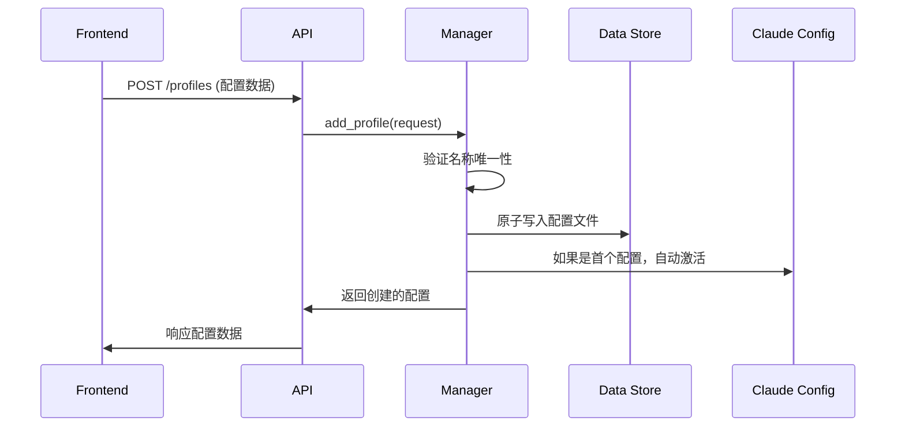
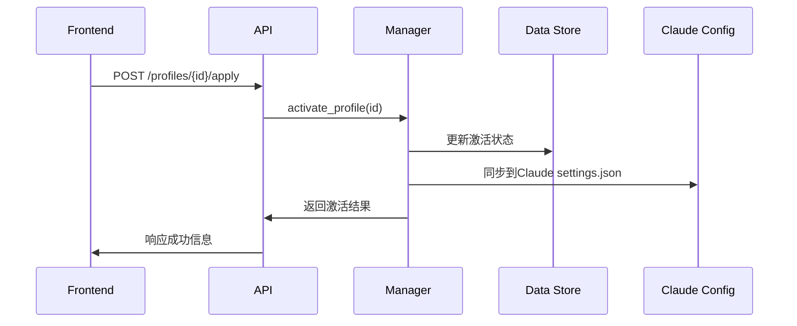

# ClaudeCodeManager

Claude Code API配置管理系统 - 前后端分离架构

## 🚀 快速开始

### 一键启动
```bash
./start.sh
```

### 手动启动

#### 后端服务
```bash
cd backend
python -m venv venv
source venv/bin/activate  # Windows: venv\Scripts\activate
pip install -r requirements.txt
python main.py
```

#### 前端界面
```bash
cd frontend
npm install
npm run dev
```

## 📋 功能特性

### ⚡ 快捷操作
- **一键切换**: 顶部下拉选择器快速切换API配置
- **状态一览**: 卡片式布局，激活状态直观显示
- **即点即用**: 配置卡片点击直接激活
- **快速创建**: 浮动按钮+表单验证快速添加配置

### 🛠️ 配置管理
- **CRUD操作**: 完整的配置增删改查功能
- **自动同步**: 激活配置自动同步到Claude Code设置
- **安全保护**: API密钥脱敏显示，防止泄露
- **备份恢复**: 支持配置数据备份和恢复

### 🎨 用户体验
- **响应式设计**: 支持桌面和移动端
- **实时状态**: 服务状态和配置状态实时更新
- **错误处理**: 友好的错误提示和重试机制
- **加载反馈**: 优雅的加载动画和状态提示

## 🏗️ 技术架构

### 整体架构设计
采用现代化前后端分离架构，通过RESTful API进行数据交互，支持配置的全生命周期管理。

```
┌─────────────────┐    HTTP/JSON    ┌──────────────────┐    File I/O    ┌─────────────────┐
│   Vue 3 前端    │ ◄─────────────► │   FastAPI 后端   │ ◄─────────────► │   数据存储      │
│                 │                 │                  │                 │                 │
│ • TypeScript    │                 │ • Python 3.9+   │                 │ • JSON 文件     │
│ • Element Plus  │                 │ • Pydantic 验证  │                 │ • 原子性写入    │
│ • Pinia 状态    │                 │ • 依赖注入       │                 │ • 线程安全      │
│ • Axios HTTP    │                 │ • CORS 支持      │                 │ • 自动备份      │
└─────────────────┘                 └──────────────────┘                 └─────────────────┘
                                             │
                                             │ Claude 集成
                                             ▼
                                    ┌──────────────────┐
                                    │ ~/.claude/       │
                                    │ settings.json    │
                                    │ 自动同步配置      │
                                    └──────────────────┘
```

### 后端技术栈
- **FastAPI 0.104.1**: 现代化、高性能的Web框架，支持自动API文档生成
- **Pydantic 2.5.0**: 数据验证和序列化，确保类型安全
- **Uvicorn 0.24.0**: ASGI服务器，支持异步处理和自动重载
- **Python-multipart 0.0.6**: 支持表单数据处理
- **线程安全**: 使用锁机制确保并发操作的数据一致性

### 前端技术栈
- **Vue 3.5.18**: 组合式API，更好的TypeScript支持
- **TypeScript 5.8.0**: 提供完整的类型安全保障
- **Element Plus 2.10.5**: 企业级UI组件库，美观且功能完善
- **Pinia 3.0.3**: Vue 3官方推荐的状态管理库
- **Axios 1.11.0**: Promise-based HTTP客户端
- **Vite 7.0.6**: 快速的构建工具，支持热更新
- **Vue Router 4.5.1**: 官方路由管理

### 核心设计模式

#### 1. 依赖注入模式
```python
def get_api_config_manager() -> ApiConfigManager:
    """提供ApiConfigManager单例实例"""
    return ApiConfigManager()
```

#### 2. 原子操作模式
```python
# 临时文件 + 原子重命名，确保数据完整性
with tempfile.NamedTemporaryFile(mode='w', delete=False) as tmp_file:
    json.dump(data, tmp_file, indent=2)
    os.rename(tmp_file.name, self.config_file)
```

#### 3. 单一数据源模式
- 所有配置统一存储在 `data/api_configs.json`
- 激活的配置自动同步到 `~/.claude/settings.json`
- 前端状态与后端数据保持一致

#### 4. 响应式状态管理
```typescript
// Pinia Store 提供响应式数据管理
export const useConfigStore = defineStore('config', {
  state: () => ({
    profiles: [] as ApiConfigProfile[],
    activeProfileId: null as string | null
  })
})
```

### 数据流架构

#### 配置创建流程


#### 配置激活流程


### 安全设计

#### 1. 数据脱敏
- API密钥在所有响应中显示为 `sk-***` 格式
- 完整密钥仅在内部处理和Claude配置同步时使用

#### 2. 原子性操作
- 所有文件写入使用临时文件 + 原子重命名
- 防止并发写入导致的数据损坏

#### 3. 线程安全
```python
class ApiConfigManager:
    def __init__(self):
        self._lock = threading.Lock()
    
    def _save_config(self, config_data: dict):
        with self._lock:
            # 原子性写入操作
```

#### 4. 输入验证
- Pydantic模型确保所有输入数据格式正确
- FastAPI自动进行请求验证和错误处理

### 扩展性设计

#### 1. 模块化架构
- 清晰的模块边界，便于功能扩展
- 每个模块独立的路由、模型、业务逻辑

#### 2. 配置化设计
- CORS策略可配置
- API前缀和版本可配置
- 数据存储路径可配置

#### 3. 插件化可能
- 支持不同的配置存储后端
- 支持多种Claude Code集成方式
- 预留扩展接口

### 性能优化

#### 1. 异步处理
- FastAPI原生支持async/await
- 非阻塞的I/O操作

#### 2. 前端优化
- Vue 3 Composition API提供更好的性能
- Vite构建工具支持代码分割和懒加载
- Element Plus按需引入减少包体积

#### 3. 缓存策略
- 前端状态管理减少API调用
- 合理的组件缓存策略

### 监控与日志

#### 1. 结构化日志
- 使用Python标准logging模块
- 关键操作记录详细日志

#### 2. 错误处理
- 分层异常处理机制
- 用户友好的错误信息
- 详细的开发者错误信息

## 🌐 服务地址

- **前端界面**: http://localhost:50001
- **后端API**: http://localhost:50000
- **API文档**: http://localhost:50000/docs
- **ReDoc文档**: http://localhost:50000/redoc

## 📁 项目结构

```
ClaudeCodeManager/
├── backend/                 # 后端服务
│   ├── main.py             # FastAPI应用入口
│   ├── modules/            # 功能模块
│   │   └── api_config/     # API配置管理模块
│   │       ├── models.py   # 数据模型定义
│   │       ├── manager.py  # 业务逻辑管理
│   │       └── routes.py   # API路由定义
│   ├── tests/              # 后端测试
│   └── requirements.txt    # Python依赖
├── frontend/               # 前端应用
│   ├── src/
│   │   ├── components/     # Vue组件
│   │   │   ├── ConfigCard.vue    # 配置卡片组件
│   │   │   ├── ConfigForm.vue    # 配置表单组件
│   │   │   └── StatusBar.vue     # 状态栏组件
│   │   ├── stores/         # Pinia状态管理
│   │   ├── services/       # API服务
│   │   ├── types/          # TypeScript类型
│   │   └── views/          # 页面组件
│   │       └── Dashboard.vue     # 主控制面板
│   └── package.json        # Node.js依赖
├── data/                   # 数据存储
│   └── api_configs.json    # 配置数据
├── CLAUDE.md               # Claude Code 集成说明
└── start.sh                # 一键启动脚本
```

## 🔧 开发命令

```bash
# 后端开发
cd backend && python main.py           # 启动后端服务
cd backend && pytest                   # 运行测试
cd backend && python -m flake8 modules # 代码检查

# 前端开发  
cd frontend && npm run dev             # 启动开发服务器
cd frontend && npm run build           # 构建生产版本
cd frontend && npm run lint            # 代码检查
cd frontend && npm run type-check      # 类型检查
```

## 📚 API文档

### 基础信息
- **Base URL**: `http://localhost:50000/api/v1/api-config`
- **Content-Type**: `application/json`
- **Interactive API文档**: http://localhost:50000/docs

### 核心端点

#### 1. 获取所有配置
```http
GET /profiles
```
**响应示例:**
```json
{
  "profiles": [
    {
      "id": "uuid-string",
      "name": "OpenAI GPT-4",
      "api_key": "sk-***",
      "base_url": "https://api.openai.com/v1/chat/completions",
      "created_at": "2024-01-01T00:00:00",
      "updated_at": "2024-01-01T00:00:00",
      "is_active": true
    }
  ],
  "active_profile_id": "uuid-string",
  "total_count": 1
}
```

#### 2. 创建配置
```http
POST /profiles
Content-Type: application/json

{
  "name": "My API Config",
  "api_key": "sk-your-api-key",
  "base_url": "https://api.example.com/v1/chat/completions"
}
```

#### 3. 更新配置
```http
PUT /profiles/{profile_id}
Content-Type: application/json

{
  "name": "Updated Config Name",
  "api_key": "sk-updated-key",
  "base_url": "https://api.updated.com/v1/chat/completions"
}
```

#### 4. 激活配置
```http
POST /profiles/{profile_id}/apply
```
**响应示例:**
```json
{
  "success": true,
  "message": "配置 'OpenAI GPT-4' 已成功激活并应用到Claude Code",
  "applied_profile": {
    "id": "uuid-string",
    "name": "OpenAI GPT-4",
    "api_key": "sk-***",
    "base_url": "https://api.openai.com/v1/chat/completions"
  }
}
```

#### 5. 删除配置
```http
DELETE /profiles/{profile_id}
```

#### 6. 获取当前配置
```http
GET /current
```

#### 7. 获取服务状态
```http
GET /status
```

#### 8. 备份配置
```http
POST /backup
```

### 数据模型

#### ApiConfigProfile
```typescript
interface ApiConfigProfile {
  id: string;           // UUID标识符
  name: string;         // 配置名称（唯一）
  api_key: string;      // API密钥（响应中脱敏显示）
  base_url: string;     // API基础URL
  created_at: string;   // 创建时间（ISO格式）
  updated_at: string;   // 更新时间（ISO格式）
  is_active: boolean;   // 是否为激活配置
}
```

#### 请求模型
```typescript
// 创建配置请求
interface CreateApiConfigRequest {
  name: string;      // 配置名称
  api_key: string;   // API密钥
  base_url: string;  // API基础URL
}

// 更新配置请求
interface UpdateApiConfigRequest {
  name?: string;     // 可选：新的配置名称
  api_key?: string;  // 可选：新的API密钥
  base_url?: string; // 可选：新的API基础URL
}
```

## 📖 使用说明

1. **创建配置**: 点击"新增配置"按钮，填写API配置信息
2. **激活配置**: 点击配置卡片上的"激活"按钮或使用顶部快捷切换器
3. **编辑配置**: 点击配置卡片上的"编辑"按钮修改配置
4. **删除配置**: 点击"删除"按钮，系统会自动处理激活状态切换
5. **备份配置**: 使用"备份配置"功能保存当前配置数据

## 🔒 安全特性

- API密钥自动脱敏显示（sk-***格式）
- 配置文件原子性写入，防止数据损坏
- CORS配置确保安全的跨域访问
- 输入验证防止恶意数据注入

## 🚨 故障排除

### 常见问题解决

#### 后端服务无法启动
1. **Python版本检查**: 确保Python 3.9+
```bash
python --version  # 应该显示 Python 3.9.x 或更高
```

2. **依赖安装问题**:
```bash
cd backend
pip install --upgrade pip
pip install -r requirements.txt
```

3. **端口占用**:
```bash
# 检查端口50000是否被占用
lsof -i :50000
# 或在Windows中
netstat -ano | findstr :50000
```

4. **权限问题**: 确保当前用户有写入`data/`目录的权限

#### 前端无法连接后端
1. **后端健康检查**:
```bash
curl http://localhost:50000/health
# 应该返回: {"status": "healthy", "timestamp": "2025-08-07"}
```

2. **CORS配置**: 检查后端`main.py`中的CORS设置
3. **防火墙设置**: 确保本地防火墙允许50000和50001端口

#### 配置同步失败
1. **Claude设置文件路径**:
```bash
# Linux/macOS
ls -la ~/.claude/settings.json
# Windows
dir %USERPROFILE%\.claude\settings.json
```

2. **权限检查**: 确保有读写权限
```bash
chmod 644 ~/.claude/settings.json
```

3. **备份恢复**: 如果配置文件损坏
```bash
cd backend
python -c "
from modules.api_config.manager import ApiConfigManager
manager = ApiConfigManager()
manager.backup_config()
"
```

### 开发环境完整配置指南

#### 1. 系统要求
- **操作系统**: Linux, macOS, Windows 10+
- **Python**: 3.9+ (推荐3.11+)
- **Node.js**: ^20.19.0 || >=22.12.0
- **Git**: 用于版本控制

#### 2. Python环境设置
```bash
# 创建虚拟环境
python -m venv venv

# 激活虚拟环境
# Linux/macOS:
source venv/bin/activate
# Windows:
venv\Scripts\activate

# 升级pip和安装依赖
pip install --upgrade pip
pip install -r backend/requirements.txt
```

#### 3. Node.js环境设置
```bash
# 检查版本
node --version
npm --version

# 安装前端依赖
cd frontend
npm install

# 或使用更快的包管理器
npm install -g pnpm
pnpm install
```

#### 4. 开发工具配置

##### VSCode配置
创建`.vscode/settings.json`:
```json
{
  "python.defaultInterpreterPath": "./backend/venv/bin/python",
  "python.linting.enabled": true,
  "python.linting.flake8Enabled": true,
  "eslint.workingDirectories": ["frontend"],
  "typescript.preferences.importModuleSpecifier": "relative",
  "vue.codeActions.enabled": true
}
```

##### 推荐的VSCode插件
```json
{
  "recommendations": [
    "ms-python.python",
    "ms-python.flake8",
    "Vue.volar",
    "bradlc.vscode-tailwindcss",
    "esbenp.prettier-vscode",
    "dbaeumer.vscode-eslint",
    "ms-vscode.vscode-typescript-next"
  ]
}
```

#### 5. 数据库初始化
```bash
# 创建数据目录
mkdir -p data

# 初始化配置文件（如果不存在）
cat > data/api_configs.json << 'EOF'
{
  "profiles": [],
  "active_profile_id": null,
  "last_updated": "2025-08-07T00:00:00"
}
EOF
```

#### 6. 环境变量配置
```bash
# 后端环境变量（可选）
cat > backend/.env << 'EOF'
# API配置
API_HOST=0.0.0.0
API_PORT=50000
DEBUG=true

# CORS配置
ALLOWED_ORIGINS=http://localhost:50001,http://127.0.0.1:50001

# 日志级别
LOG_LEVEL=INFO
EOF

# 前端环境变量
cat > frontend/.env.development << 'EOF'
VITE_API_BASE_URL=http://localhost:50000
VITE_APP_TITLE=ClaudeCodeManager
VITE_APP_VERSION=1.0.0
EOF
```

#### 7. 开发服务启动验证
```bash
# 启动后端（终端1）
cd backend
python main.py

# 启动前端（终端2）
cd frontend
npm run dev

# 验证服务
curl http://localhost:50000/health
curl http://localhost:50000/api/v1/api-config/status
open http://localhost:50001
```

### 性能优化建议

#### 后端优化
1. **异步处理**: 使用FastAPI的async/await特性
2. **连接池**: 对于数据库连接使用连接池
3. **缓存策略**: 实现适当的缓存机制
4. **日志优化**: 生产环境使用结构化日志

#### 前端优化
1. **懒加载**: 路由级别的代码分割
2. **组件缓存**: 使用Vue的KeepAlive
3. **API缓存**: 实现请求缓存机制
4. **Bundle分析**: 定期分析构建包大小

```bash
# 构建分析
cd frontend
npm run build
npx vite-bundle-analyzer dist
```

### 测试与质量保证

#### 后端测试
```bash
cd backend
# 运行单元测试
python -m pytest tests/ -v
# 代码覆盖率
python -m pytest tests/ --cov=modules --cov-report=html
# 代码质量检查
python -m flake8 modules/
python -m mypy modules/
```

#### 前端测试
```bash
cd frontend
# 类型检查
npm run type-check
# 代码规范检查
npm run lint
# 格式化代码
npm run format
```